# Bigbrands
Bigbrands is a django website application for a clothing and accessory retailer. Its goal is to provide users with a safe and simple experience. This project was built with the Django framework and supporting languages such as Python, HTML, CSS, JavaScript, and other libraries such as Crispy, Summernote Allauth, and Stripe.

## Table of Content

- [Responsiveness](#responsiveness)

- [Site Scope](#site-scope)
    * [user stories](#user-stories)

- [Site Features](#site-features)
    * [Site Navigation](#site-navigation)
    * [Features left to implement](#features-left-to-implement)

- [Language, Framework, Library and Tools](#language-framework-library-and-tools)

- [Deployment](#deployment)

- [Credits](#credits)

- [Acknowledgment](#acknowledgment)

- [Disclaimer](#disclaimer)

## Responsiveness:
The site is responsive and can be easily accessed with full functionality in full screen, tablet and mobile screen

* Responsive Design: Bigbrands' websites should be fully responsive in all devices with screen sizes 280 and up. 
* There should be no loss of functionality when switching between mobile devices, tablets, and desktops.
* Site visitors can view products and blog posts. 
* Site visitors can make purchases without creating an account. Users can interact with blog posts by liking or disliking them..
* Site users can create a personal account, save and view their order history, and update and review the products they have purchased.
* Logged in users' ability to perform full CRUD functionality on their profile and reviews posted on the site 
* Logged in users' ability to interact with posts in the blog section

### User stories
| As a...                | I can...                                                 | So I can...                                                                 |
| :------------          |   :------------------------                              |        :--------------------------                                          |
|As a user               | I can see all products           |  so that I can select some to purchase.                                          |
|As a user               | I can view individual products                          |so that I can see the rating, details, specifications, price, quantity
|As a user                |I can easily identify deals and clearance               |so that I can benefit from the deals and promotions
|As a user               |I can search for a product by name or category           |so that I can find a product easily and quickly
|As a user               |I can sort available products in order of prices or brand |so that I can make informed decision and manage purchase and expense parameters
|As a user               |I can add items I want into a bag                        |so that I can easily add or remove items
|As a user                |I can view the total of my purchase                       |so that I can make informed decision on how much I am spending
|As a user                  |I can view list of posted blogs                        |so that I can select and read any one I like
|As a user                  | I can click on a post                                  |  so that I can read the full post.
|As a user             |I can easily register an account                       |so that I will be able to view my profile
|As a user             |I can Easily Login and Logout                          |so that I can access my personal information
|As a user             |I can easily recover my password                       |so that I can log back into my profile
|As a user             |I can have a personalized user profile                 |so that I can view my order history update my user profile and save my payment confirmation
|As a user             |I can Subscribe to sites newsletter                    |so that I can receive informative newsletters and benefit from any deals available
|As a user               |I can save purchase history to my profile              |so that I can review the items and plan feature purchases
|As a user               |I can pay for products in my shopping bag securely     |so that I can feel safe and confident using my card on the site
|As a Site Admin        |I can view a data entry form                           |so that I can add, update and delete products and posts

[back to content](#table-of-content)

## Site Features
### Site Navigation:
The navigation bar is fully responsive and displays a different layout but the same functionality on the mobile and desktop sites.
The company name also serves as a home button, allowing users to navigate to the home page with a single click.
For ease of use, a search bar is conveniently placed in the centre, and on mobile, it drops down below the navbar in a convenient line of sight.
The user account and store bag links are on the right; both icons are designed to display information that the user can easily recognise.
* The account icon hides a dropdown indicated by the down chevron arrow.
* If user is not logged in the options to register or login is shown.
* If logged in the opitons to manage store (if superuser), profile and logout is shown.

Navigation Menu ScreenShots

 Site Navigation

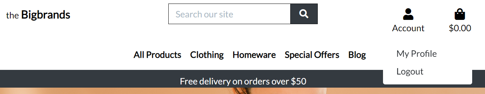

 Navigation user not logged in

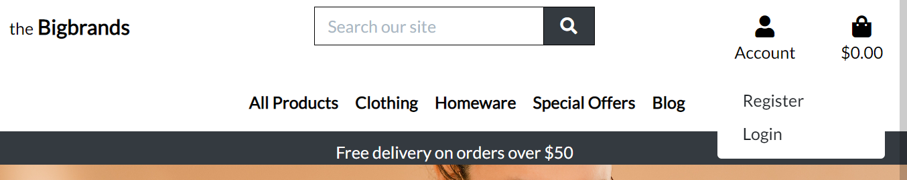

 Navigation mobile view

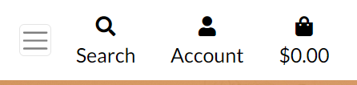

 Navigation mobile view search dropdown

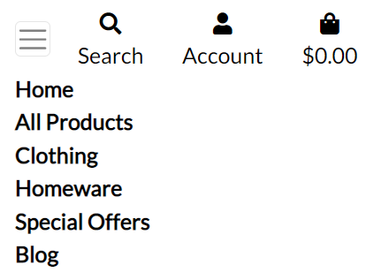
 

 

### Home Page:
Upon visiting the ecommerce landing page, the first thing that strikes the visitor is the clean and professional design. The color scheme is cohesive and the font is easy to read, with clear calls to action that make it easy to navigate the site. The page is well-organized with an intuitive layout, providing a seamless user experience and a `SHOP NOW` button leading to the products page.

Home Page

  Home Page

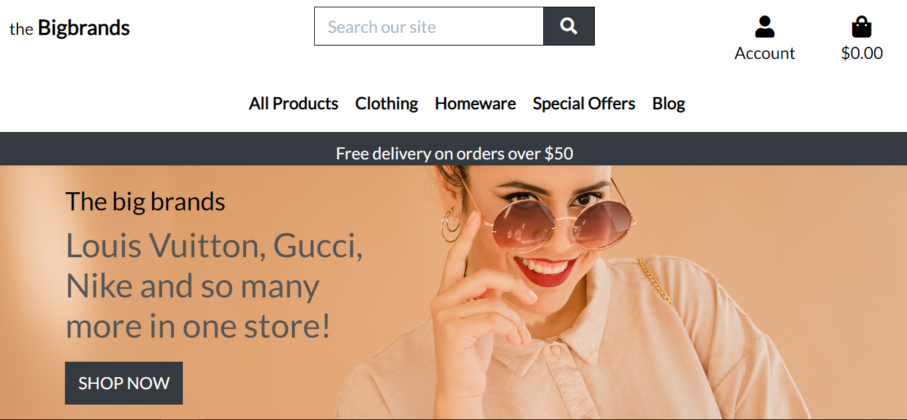

 Mobile Home Page

### Footer:
The footer section contains:
* A prominent newsletter signup form that lets you learn first about special deals and promotions.
* Links to PicknStrum's social media channels that are functional.
* Links to the contact, about, safety, and privacy pages of the website

Site Footer and associated pages

 Footer

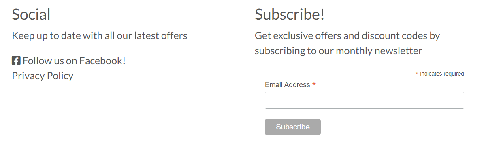

### Product Page:
To access the Product page, use the drop-down menus on the primary navigation row below the search box.Product details, such as name, price, category, and rating, are organised in responsive cards.
For logged-in site administrators, editing or deleting a product is also an option.
Users can view individual products by clicking on them and then choosing whether to add them to their shopping bags or return to the list of all available products.
The select option dropdown lets you change the number of products you want to buy.

Product Page

 Product List

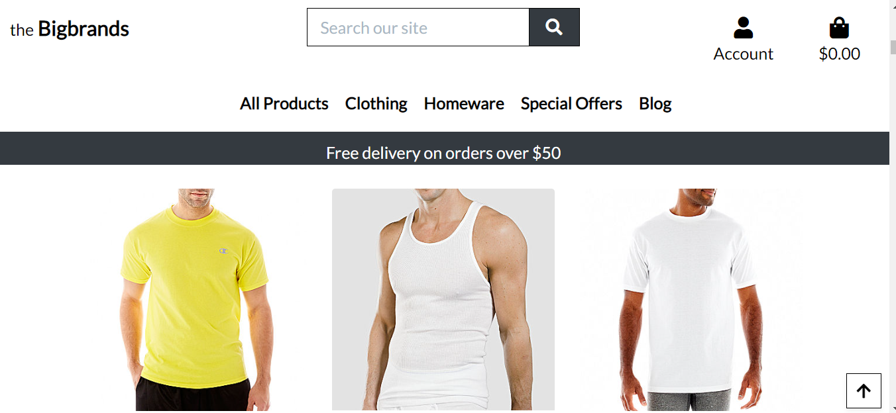
 Product Detail Page

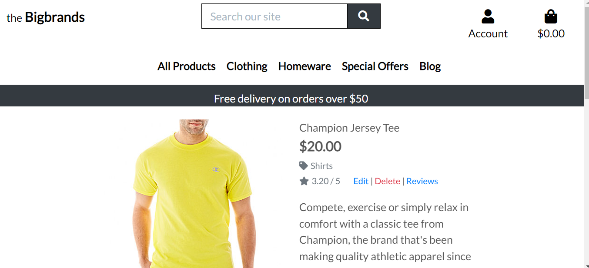

### Bag:
You can access bag content by clicking on the bag icon as well as from toast notifications.  
The contents can be changed or removed appropriately.

Shopping Bag

 Bag Content

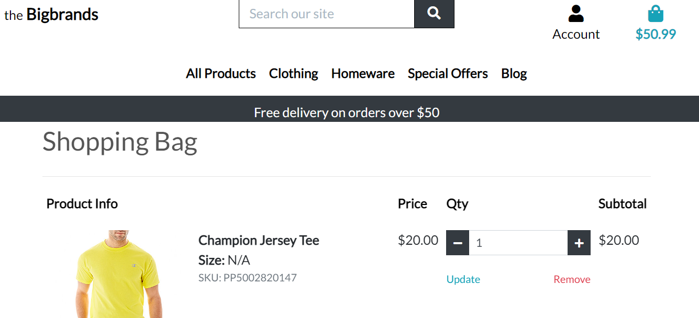

### Checkout Success:
A summary checkout success page is displayed to the user when a successful payment is made.

Checkout Success

 Payment Page

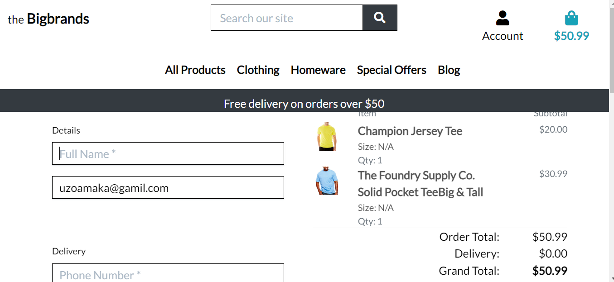
 Checkout Success page

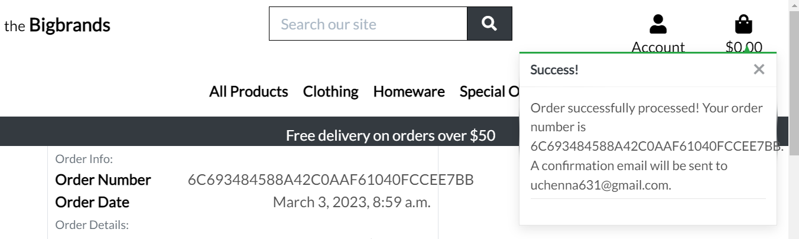

### Profile:
When logged in, registered users can examine their order history, evaluate a product they've purchased, edit or delete a review, update their profile, and change their profile image, among other straightforward CRUD operations.

Profile

 Profile Pages

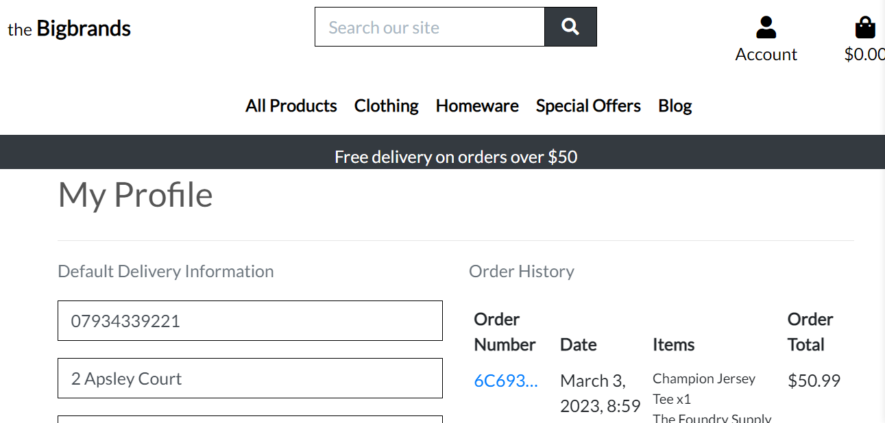
 

### Blog
The footer and main navigation on the home page both link to the blog. The Top stories category is displayed at the top of the page while the other categories are presented below. Posts are organized into categories. Clicking on the post image will take you to each post's page. If a user is logged in, they can interact with the detailed post view.

Blog Post

 Blog Page

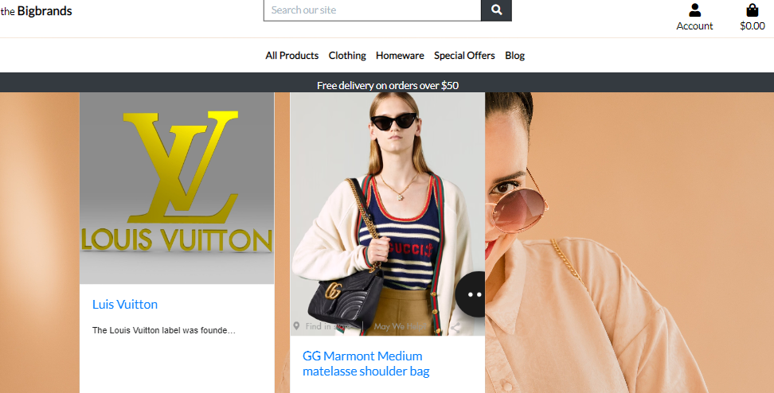
 Blog Page Detail

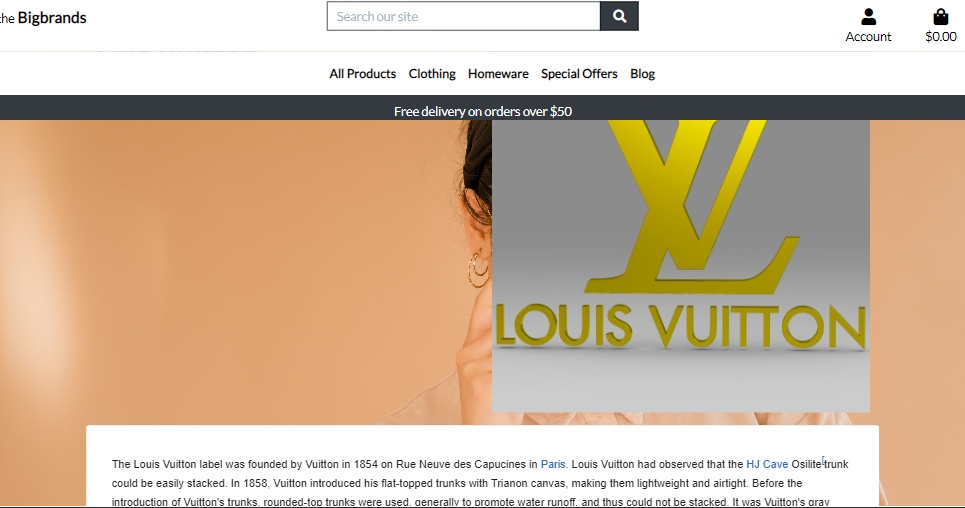
 

## Media Marketing
### Facebook page
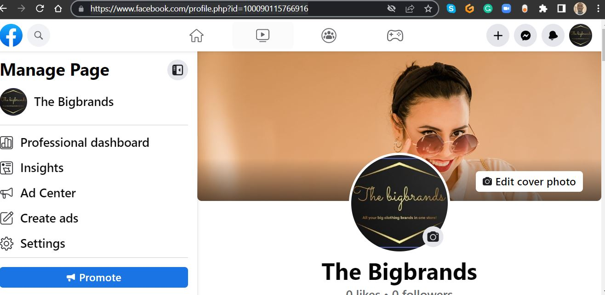

### Features left to implement:
* Order processing, stock tracking and order delivery.

 [back to content](#table-of-content)
  

## Language, Framework, Library and Tools
* HTML5 [More on HTML5 ](https://en.wikipedia.org/wiki/HTML5)
* CSS3 [More on CSS](https://en.wikipedia.org/wiki/CSS)
* JavaScript [More on JavaScript](https://en.wikipedia.org/wiki/JavaScript)
* Python [Python](https://www.python.org/) [Read More on Python](https://en.wikipedia.org/wiki/Python_(programming_language))
* Bootstarp 5 [Bootstrap](https://getbootstrap.com/)
* Django [Django](https://www.djangoproject.com/)
* Psycopg2 [PostgreSQl](https://www.postgresql.org/)
* Django-allauth [django-allauth read the doc](https://django-allauth.readthedocs.io/en/latest/)
* Crispy-form [django-crispy-form read the doc](https://django-crispy-forms.readthedocs.io/en/latest/install.html)
* Summernote [Summernote Docs](https://summernote.org/)
* Balsamiq [more on Balsamiq](https://balsamiq.com/)
* Heroku [more on Heroku](https://devcenter.heroku.com/)

[back to content](#table-of-content)

## Deployment
The steps in deployment is recorded [here](deployment.md)

[back to content](#table-of-content)

## Credits
* Code Institute [Code Institute](https://codeinstitute.net/ie/)
* Django Doc [read the doc](https://docs.djangoproject.com/en/4.0/)
* Pixabay for the images used on the site [Pixabay](https://pixabay.com/)* 
* [wikepedia](https://www.wikipedia.org/).desccription.

[back to content](#table-of-content)

## Acknowledgment
* Code Institute Tutor Assistance
* Mentor Spencer Barribal
* Uzoamaka, Chimamanda and Samuel Ukachukwu for their support

[back to content](#table-of-content)

## Disclaimer
This site was developed for educational purposes only. _Fimber Uchenna 2023_
