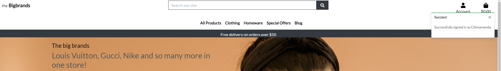
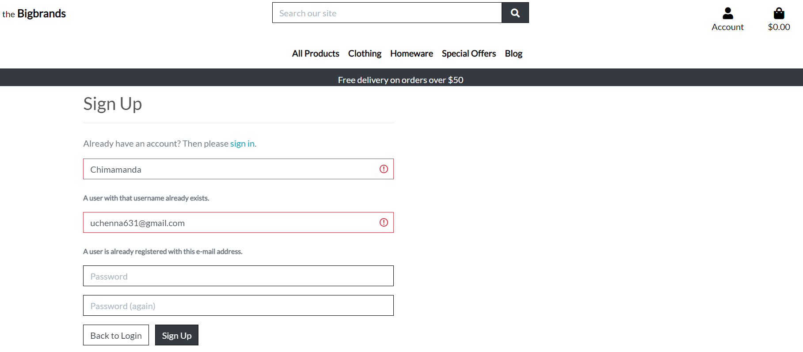
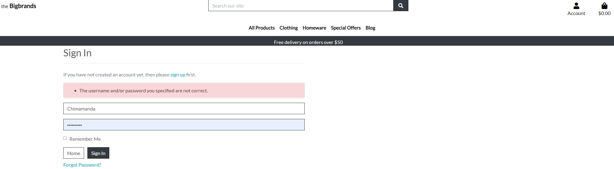
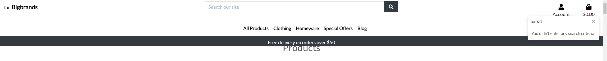
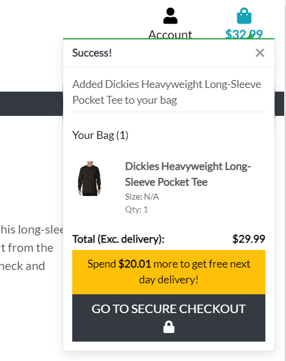
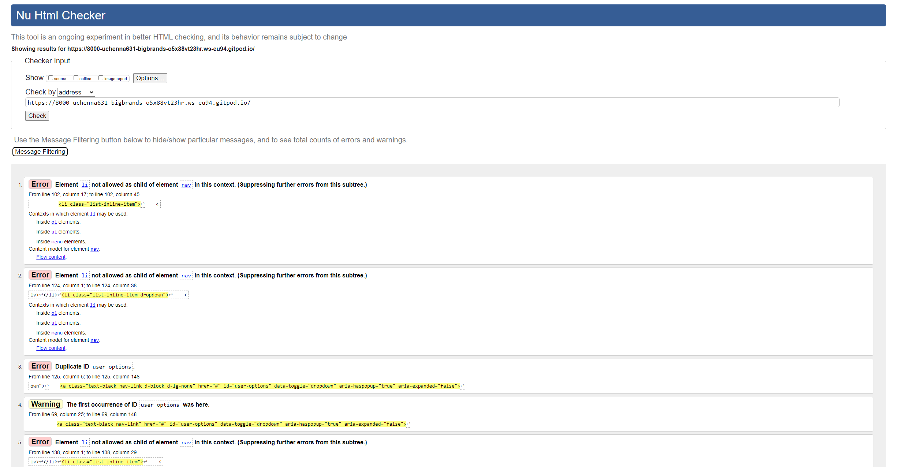
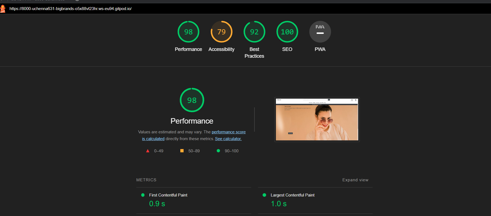

### Manual Testing Summary:
The codes were tested by doing the following:
1. In each page, the links, the buttons and the inputs were checked against the expected behaviour
2. Invalid inputs were used to test error handling behaviour.
2. Recruited help from friends to use app and offer feedback
3. Checked each page with [responsive deisgn checker](http://responsivedesignchecker.com/) for responsiveness.
4. Different browsers below were also used to check functionality
    * google chrome
    * fire fox
    * microsoft edge
5. Google chrome lighthouse waws used to check for accessibility compliance and SEO technique
* page links are not broken ``passed``
* forms gets validated and submited as should ``passed``
* images display is responsive ```passed```
* contact us form works. ```passed```
* post and product data sumbit pages work ```passed```
* 404 error display when page not found error is encountered ```passed```


### Page By Page Functionality Test Detail

<details>
<summary>Navigation Bar Tests</summary>
The navigation bar is generic and the following links were tested

1. The brand logo, `the Bigbrands` link (link to the home page) checked and passed

2. The account signup passed with feedback message.


3. Account signup return validation error when an existing user wants to signup again: preventing double registration


4. Account login test passed with feedback message. It returns error when invalid inputs are entered


- Signin Validation with wrong user inputs


5. Logout test passed with feedback message. 


6. The search bar is expected to return products with a given keyword(s). Search bar was test and it passed.
- Search Null returns error message without breaking the site. 

<br>
</details>

<details>
<summary>Home Page</summary>
<br>

1. `Shop Now` is expected to take a user to the product list page. This was tested and it passed 

</details>

<details>
<summary>Products and Product Deatails Page</summary>
<br>

1. The product image in the products page is expected to display the specific product when clicked. This link was tested Ok.

2. The product detail page is expected to:
- allow a user to modify the quantity on items to needed in the bag with the `+` and `-` sign. This was tested OK.
- return a user to the shopping page with the `KEEP SHOPPING` button. This was tested OK
- the `ADD TO BAG` button is expected to add a given product to the checkout bag. This was tested OK.


- the `GO TO SECURE CHECKOUT` 
</details>
<details>
<summary>Shopping Bag</summary>
<br>

1. The shopping bag has the following functionality:
- the `+` and `-` button is expected to increment the quantity of a given product. The button was click in turns and quantity was incresed/decreased accordingly 
- the `KEEP SHOPPING` button is expected to return a user to the shopping page. This was tested OK
- the `SECURE CHECKOUT` button is expected to take a user to a secure page. This was tested OK. 

</details>
<details>
<summary>Checkout page</summary>
<br>

1. The checkout page is expected to accept users payment securely, and create an order. This was tested and worked as it should be. The following functionalities were also tested:
- the delivery details is expected to accept user delivery details. The form is validated to ensure users fill in the details correctly. This was tested Ok 
- the `Adjust Bag` button is expected to return a user to shopping bag. This was tested OK.  
- the `Complete Order` button is expected to complete the transaction was a feedback message. This was tested OK.


</details>


### User Story Test

The user stories were tested against their expected outcome.

Expectation - As a user I can see all products so that I can select some to purchase.

Test -  Clicked "Shop Now" and "All Product" Link works and User is directed to all product pages ``passed``

Expectation - As a user I can view individual products so that I can see the rating, details, specifications, price, quantity.

Test - clicked the product image and it directed me to product detail page of the specific product ``passed``

Expectation - As a user I can easily identify deals and clearance so that I can benefit from the deals and promotions

Test - Clicked the "Seasonal offer" link which directed me to sorted list of products under the Clearance and Deals tag. ```passed```

Expectation - As a user I can search for a product by name or category so that I can find a product easily and quickly

Test - I search the word `jean` in the search bar and it return all the jeans category available.  ```passed```

Expectation - As a user I can sort available products in order of prices or brand so that I can make informed decision and manage purchase and expense parameters.

Test - I sorted products by options in the sort box ```passed```

Expectation -  As a user I can add items I want into a bag so that I can easily add or remove items.

Test - I clicked the "ADD TO BAG" button and the selected product were added to the bag. ```passed```

Expectation - As a user I can view the total of my purchase so that I can make informed decision on how much I am spending.

Test - I added products to the bag and the total appears in the bag. On checkout, the item lists and the total is displayed as well.
 ```passed```

Expectation - As a user I can view list of posted blogs so that I can select and read any one I like

Test - Clicked on the `Blog` and I was directed into the blog home page 
```passed```

Expectation - As a user I can click on a post so that I can read the full post..

Test - I clicked on a post card and viewed the post detail
 ```passed```

#### W3C HTML Validation: No Errors returned
These errors were return when passed through W3C validator. This was not resolved due to time constraint. They however do not affect functionality



#### Pep8 Validation: No errors returned
All python code validated from the terminal troubleshooting using:
```
python3 -m flake8
```
-`bag/context.py file` 
- - 2 blank lines contains whitespace
- - the blank lines were removed

-`bag/models.py file` 
- - imported app not used
- - imported app was removed

-`bag/bagtools.py file` 
- - 2 blank lines expected 
- - 2 blank lines were added

-`bigbrands/settings.py file` 
- - 4 E501 error
- - Ignored as they are django default code

-`migration files` 
- - line too long errors 
- - Ignored as they are django default code
#### Accessibility:

Accessibility testing was conducted using light house devtools and it confirmed that the fonts and colors selected are easy to read and accecssible.



Back to [home](README.md)